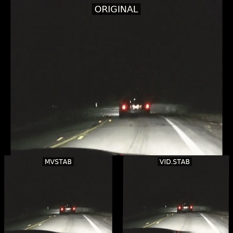
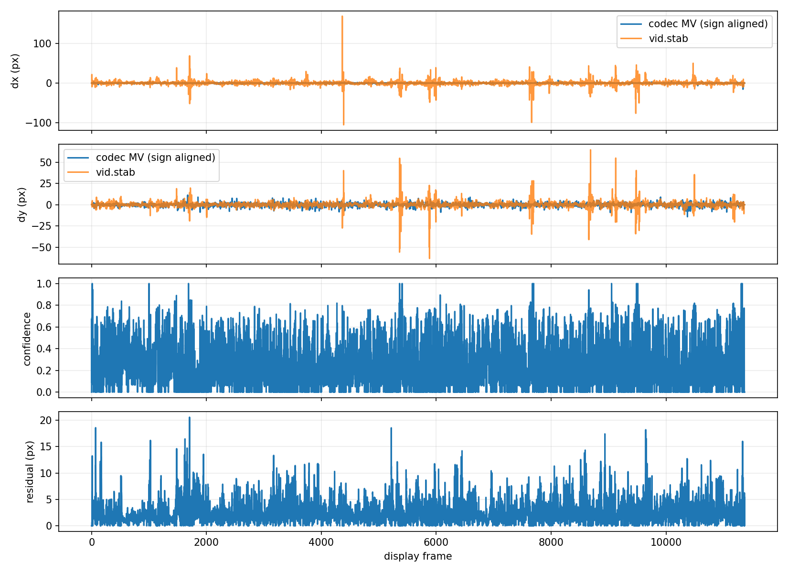

# mvstab

`mvstab` extracts H.264 prediction metadata and estimates relative camera
translation and rotation without inspecting reconstructed pixels. It emits a
transform file for FFmpeg's `vidstabtransform`, so pixels are touched only in
the final render pass.

## Showcase

[](mvstab-comparison.mp4)

The animated preview uses a calmer section of the driving clip. Select it to
open the full-length comparison.

<video
  src="https://github.com/supermartian/de-mo/raw/refs/heads/main/mvstab-comparison.mp4"
  controls
  width="720">
</video>

[Open the comparison video directly](mvstab-comparison.mp4)

The top panel is the original H.264 video. The lower panels show the same
full-length sequence stabilized by mvstab (left) and pixel-domain vid.stab
(right).

The repository includes:

- a stock-FFmpeg fallback using `AV_FRAME_DATA_MOTION_VECTORS`;
- an FFmpeg patch that exports exact H.264 references and adds syntax-only
  motion decoding;
- exact reference-time normalization for P and B pictures;
- robust, spatially balanced affine fits per exact reference;
- 31-frame block-grid histories that reject compact persistent foreground;
- a diagonally preconditioned, confidence-weighted exact-reference pose graph;
- CSV/JSON diagnostics and vid.stab-compatible transforms;
- comparison, plotting, unit, and encoded end-to-end tests.

See [`design.md`](design.md) for the H.264 derivation, FFmpeg data-flow audit,
patch contract, equations, validation, and limitations. The original V0
proposal remains in `mvstab_ffmpeg_codec_motion_vector_design.md` for history.

## Build with stock FFmpeg

Install CMake, a C11 compiler, and development packages for `libavformat`,
`libavcodec`, and `libavutil`.

```sh
cmake -S . -B build -DCMAKE_BUILD_TYPE=Release
cmake --build build -j
ctest --test-dir build --output-on-failure
```

This works with FFmpeg 4.4 and newer. It reconstructs pixels internally and
has only earlier/later reference direction, so multi-reference timing is
approximate.

The FFmpeg-independent core can be built separately:

```sh
cmake -S . -B build-core -DMVSTAB_BUILD_CLI=OFF
cmake --build build-core -j
ctest --test-dir build-core --output-on-failure
```

## Build the patched H.264 extractor

The helper clones the pinned FFmpeg revision, applies the checked-in patch,
builds a minimal shared-library installation, and rejects existing source or
install directories rather than overwriting them:

```sh
scripts/build_patched_ffmpeg.sh /tmp/mvstab-ffmpeg /tmp/mvstab-ffmpeg-install
```

Build `mvstab` against it:

```sh
PKG_CONFIG_PATH=/tmp/mvstab-ffmpeg-install/lib/pkgconfig \
  cmake -S . -B build-patched -DCMAKE_BUILD_TYPE=Release \
    -DMVSTAB_REQUIRE_EXACT_METADATA_TESTS=ON
cmake --build build-patched -j

LD_LIBRARY_PATH=/tmp/mvstab-ffmpeg-install/lib \
  ctest --test-dir build-patched --output-on-failure
```

At runtime, use the same `LD_LIBRARY_PATH`. `mvstab` automatically requests
`motion_metadata_only=1` for H.264. If the decoder does not know that option it
falls back to full software decode.

## Inspect and dump metadata

```sh
LD_LIBRARY_PATH=/tmp/mvstab-ffmpeg-install/lib \
  build-patched/mvstab inspect input.mp4 --frame 217

LD_LIBRARY_PATH=/tmp/mvstab-ffmpeg-install/lib \
  build-patched/mvstab dump input.mp4 --format csv -o vectors.csv
```

`inspect` reports the selected decode path, exact/timestamped references,
list-1 use, long-term references, direct/skip predictions, partition sizes,
and vector magnitudes.

The dump preserves raw codec values and adds canonical fields including:

- `mv_ref_to_cur_x`, `mv_ref_to_cur_y`;
- exact POC and timestamp deltas;
- list/index, long-term, and field identity;
- direct, skip, and interlaced provenance.

## Analyze and stabilize

```sh
LD_LIBRARY_PATH=/tmp/mvstab-ffmpeg-install/lib \
  build-patched/mvstab analyze input.mp4 \
    --mode safe \
    -o motion.trf \
    --stats motion.csv
```

Render with an FFmpeg build that contains `vidstabtransform`:

```sh
ffmpeg -i input.mp4 \
  -vf "vidstabtransform=input=motion.trf:relative=1:smoothing=30:optzoom=1" \
  -c:v libx264 -crf 18 -c:a copy stabilized.mp4
```

Always set `relative=1`. The transform contains inverse translation and the
vid.stab-calibrated rotation sign. Scale is fitted as a nuisance term and is
reported in stats, but the transform's zoom field is currently zero.

### Long-horizon pure-MV analysis

Each exact-reference fit retains a compact 8×4 grid of local block motion.
Across a 31-frame window, mvstab follows residual motion through neighboring
grid cells. A region is treated as foreground only when its displacement is
large, directionally consistent for at least nine observations, and occupies
no more than one quarter of the supported cells. The reference edge is then
refit without that region. Rates use exact reference timestamps, so variable
frame duration does not turn equal physical motion into unequal evidence.

The history crosses isolated keyframes because an I-picture is treated as a
missing observation, not an automatic cut. Continuity gates still prevent a
missing keyframe transform from being filled when motion on its two sides
disagrees; timestamp gaps also reset the history. No luma, chroma,
reconstructed frame, optical flow, or feature tracking is used by
`mvstab analyze`.

With exact metadata, safe mode uses both P and B pictures, fits each exact
reference separately, and solves their constraints as a confidence-weighted
camera pose graph. When adjacent exact edges cover the sequence densely, they
form the graph; long uncovered regions can admit longer coded edges only when
the combined frame estimate also passes confidence checks. Sparse inputs fall
back to all valid references with span-scaled weights. Disconnected components
are independently anchored, and only continuous keyframe gaps are repaired.
With stock FFmpeg, safe mode uses past-reference P-picture anchors.
`--mode all-mvs` enables direction-only future-reference use on the fallback
path and should be treated as experimental.

## Test the requested YouTube clip

Download the clip and inspect its codec:

```sh
yt-dlp -f "bv*+ba/b" --merge-output-format mp4 \
  -o source.%(ext)s "https://www.youtube.com/watch?v=SVA2mq9l2X8"

ffprobe -v error -select_streams v:0 \
  -show_entries stream=codec_name,profile,width,height,r_frame_rate \
  -of default=noprint_wrappers=1 source.mp4
```

If `codec_name` is not `h264`, convert only the video stream:

```sh
ffmpeg -i source.mp4 -map 0:v:0 -map 0:a? \
  -c:v libx264 -preset medium -crf 18 -c:a copy input-h264.mp4
```

Run mvstab and the pixel-domain baseline:

```sh
/usr/bin/time -v env LD_LIBRARY_PATH=/tmp/mvstab-ffmpeg-install/lib \
  build-patched/mvstab analyze input-h264.mp4 \
    -o mvstab.trf --stats mvstab.csv

/usr/bin/time -v ffmpeg -i input-h264.mp4 \
  -vf "vidstabdetect=result=vidstab.trf:shakiness=5:accuracy=15" \
  -f null -
```

To obtain comparable global vid.stab transforms, run its second pass with no
smoothing and debug output from an otherwise empty directory:

```sh
mkdir vidstab-global
cd vidstab-global
ffmpeg -i ../input-h264.mp4 \
  -vf "vidstabtransform=input=../vidstab.trf:smoothing=0:optzoom=0:relative=1:debug=1" \
  -f null -
cd ..

python3 tools/compare_vidstab.py \
  --codec mvstab.csv \
  --vidstab vidstab-global/global_motions.trf
```

The comparison aligns display-frame numbers, calibrates translation and angle
signs independently, and reports translation/rotation correlation, errors,
PTS-normalized derivative error, jitter-band energy, and confidence slices.
These are two different estimators—encoder prediction versus pixel patches—so
disagreement is diagnostic rather than proof that either transform is ground
truth.

## Measured driving-clip result

The supplied clip was already H.264 Main profile, 720×480 at 29.97 fps, with
11,369 frames over 379.35 seconds.

On the same host:

- patched metadata-only H.264 decode: 3.28 s, versus 12.12 s full decode;
- complete temporal `mvstab analyze`: 7.77 s and about 67 MB RSS;
- `vidstabdetect`: 12.71 s wall, 246.57 CPU seconds, about 129 MB RSS;
- full-decode and metadata-only exports matched byte-for-byte for all frames;
- exact metadata was present on all 20,715,192 exported prediction records;
- the old sign-only safe estimator emitted meaningful nonzero measured motion
  on 7 frames, while the exact-timed estimator measured nonzero motion on
  11,088 frames;
- after rendering each transform and measuring the remaining motion with the
  same detector settings and no-smoothing debug pass, the previous pure-MV
  baseline reaches 4.513 pixels median translation and 10.187 RMS;
- long-horizon mvstab reaches 4.211 pixels median, 9.881 RMS, and 19.739 at
  p95, while vid.stab reaches 2.283 pixels median, 5.651 RMS, and 8.014 at p95;
- long-horizon rotation reaches 0.717 degrees RMS versus the old pure-MV
  baseline's 0.751 degrees and vid.stab's 0.573 degrees.

The comparison is intentionally candid. Long-horizon block evidence improves
the previous pure-MV result without touching reconstructed pixels, but it does
not close the observability gap: vid.stab still has much better translation
tails because it measures image content directly.



## Supported codecs

- Exact references and metadata-only decode: software H.264 with the included
  FFmpeg patch.
- Fallback: any software decoder that exports
  `AV_FRAME_DATA_MOTION_VECTORS`; behavior depends on that decoder's exporter.
- No exact patched path yet: HEVC, VP9, AV1, hardware decoders, and codecs whose
  decoder does not export MVs.

Some codecs work and others do not because the container never standardizes
motion metadata. Each codec has different prediction syntax, reference lists,
partition trees, precision, merge/skip/direct modes, and decoder internals. An
FFmpeg decoder must explicitly retain and export a meaningful final motion
field; hardware APIs often do not expose it at all.

## Current limitations

- The patched decoder skips reconstruction but still allocates frame buffers.
- Damaged-stream error concealment is disabled in metadata-only mode.
- Codec MVs are encoder decisions and can be weak in flat regions or dominated
  by moving foreground objects.
- The affine nuisance fit still emits one global similarity transform; it does
  not correct parallax, perspective, mesh motion, or rolling shutter.
- Production scene-cut segmentation and resetting vid.stab smoothing at cuts
  remain future work.
- Rendering still requires one normal pixel decode and transform pass.
